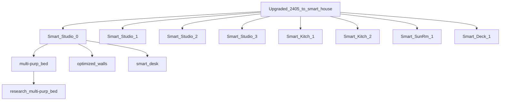

https://www.atlassian.com/agile/project-management/epics-stories-themes

```mermaid
flowchart TD
    A[Upgraded_2405_to_smart_house] --> B[Smart_Studio_0]
    A[Upgraded_2405_to_smart_house] --> C[Smart_Studio_1]
    A[Upgraded_2405_to_smart_house] --> D[Smart_Studio_2]
    A[Upgraded_2405_to_smart_house] --> E[Smart_Studio_3]
    A[Upgraded_2405_to_smart_house] --> F[Smart_Kitch_1]
    A[Upgraded_2405_to_smart_house] --> G[Smart_Kitch_2]
    A[Upgraded_2405_to_smart_house] --> H[Smart_SunRm_1]
    A[Upgraded_2405_to_smart_house] --> I[Smart_Deck_1]

    B --> J[multi-purp_bed]
    B --> K[optimized_walls]
    B --> L[smart_desk]

    J --> M[research_multi-purp_bed]
```