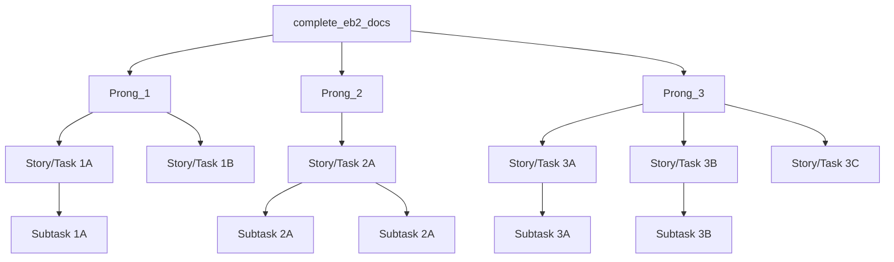

```mermaid
flowchart TD
    A[complete_eb2_docs] --> B[Prong_1]
    A[complete_eb2_docs] --> C[Prong_2]
    A[complete_eb2_docs] --> D[Prong_3]

    B --> E[Story/Task 1A]
    B --> F[Story/Task 1B]

    C --> G[Story/Task 2A]
    D --> H[Story/Task 3A]
    D --> I[Story/Task 3B]
    D --> J[Story/Task 3C]

    E --> K[Subtask 1A]

    G --> L[Subtask  2A]
    G --> M[Subtask 2A]

    H --> N[Subtask 3A]
    I --> O[Subtask 3B]
```