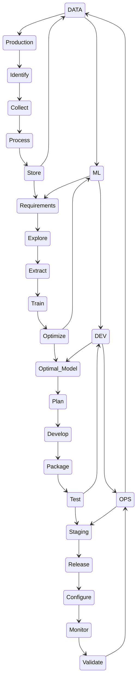

[The Modern MLOps Blueprint](https://medium.com/slalom-data-ai/the-modern-mlops-blueprint-c8322af69d21)




### Gantt Chart
```mermaid
gantt
    title A Gantt Diagram
    dateFormat  YYYY-MM-DD
    
    section DATA
    Production   :a1, 2014-01-01, 5d
    Identify     :a2, after a1  , 3d
    Collect      :a3, 2014-02-09, 10d
    Process      :a4, after a3, 7d
    Store        :a5, after a4, 2d
    
    section ML
    Requirements :a6, after a5, 10d
    Explore      :after a6, 20d
    Extract      :a7, 2014-01-01, 30d
    Train        :after a7, 20d
    Optimize     :a8, 20d
    
    section DEV
    Optimal_Model :a1, 2014-01-01, 30d
    Plan         :after a1  , 20d
    Develop      :a1, 2014-01-01, 30d
    Package      :after a1  , 20d
    Test         :after a1  , 20d

```
Where is the current project at?

What are the requirements from the client?

How much does each state cost?

How long does it take to deliver?

On a manager's perspective, how do you connect different industries?
