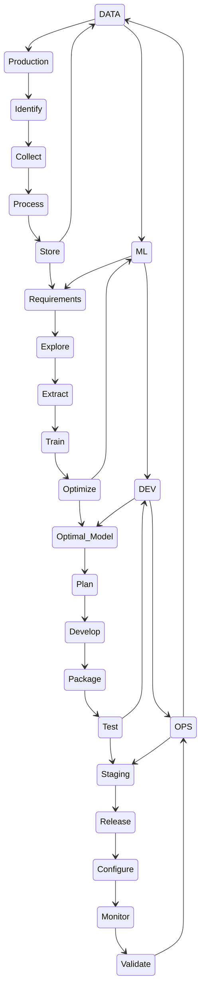

[The Modern MLOps Blueprint](https://medium.com/slalom-data-ai/the-modern-mlops-blueprint-c8322af69d21)

Where is the current project at?
What are the requirements from the client?
How much does each state cost?
How long does it take to deliver?
