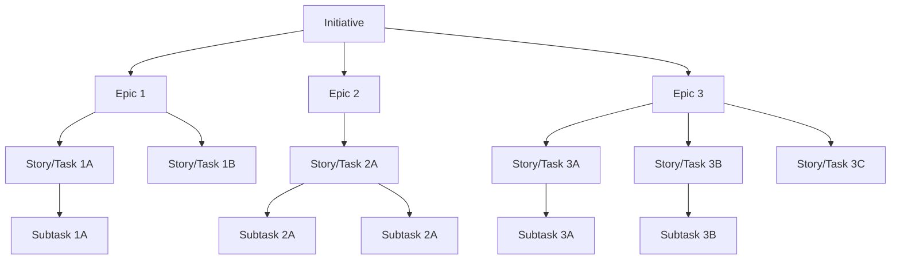

https://www.atlassian.com/agile/project-management/epics-stories-themes

---
---
## Initiative Template

||Description|
|---|---|
|Goal/Strategic Initiative|_Write Here_|
|Epic/Milestone/Risk 1|_Write Here_|
|Story 1A|_Write Here_|
|Sub-task 1A|_Write Here_|
|Epic/Milestone/Risk 2|_Write Here_|
|Story 2A|_Write Here_|
|Sub-task 2A.a|_Write Here_|
|Story 2B|_Write Here_|
|Sub-task 2B.a|_Write Here_|
|Sub-task 2B.b|_Write Here_|

---
---
## Hierarchy Levels Template

||Description|
|---|---|
|Purpose|_Write Here_|
|Vision/Objective|_Write Here_|
|Goal/Strategic Initiative|_Write Here_|
|Epic/Milestone/Risk|_Write Here_|
|Story|_Write Here_|
|Sub-task|_Write Here_|

